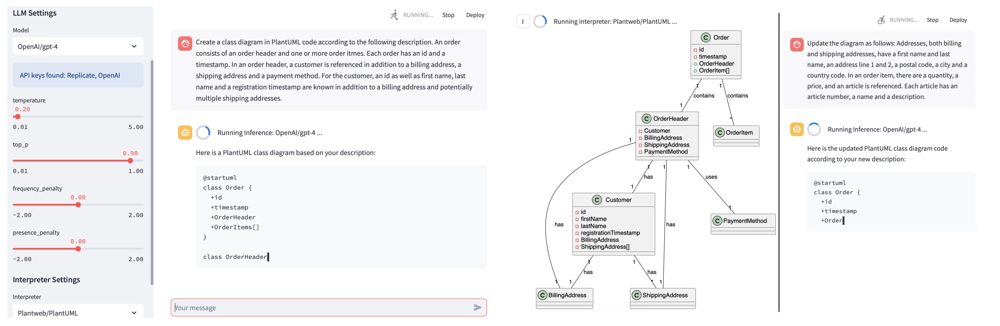
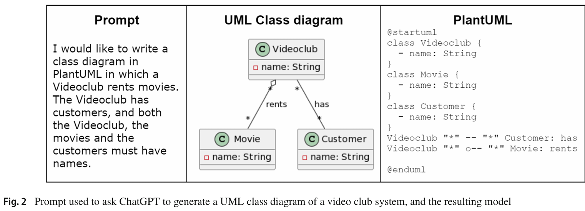
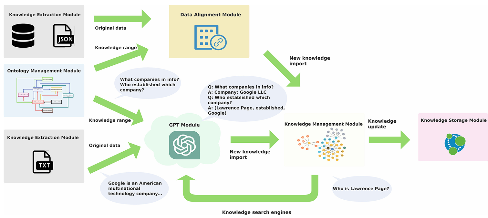
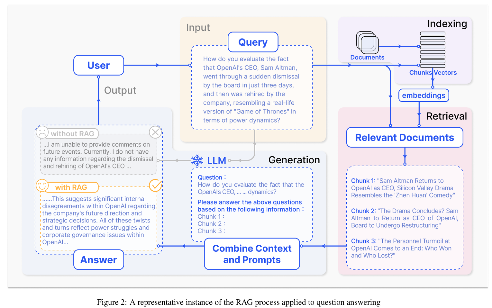
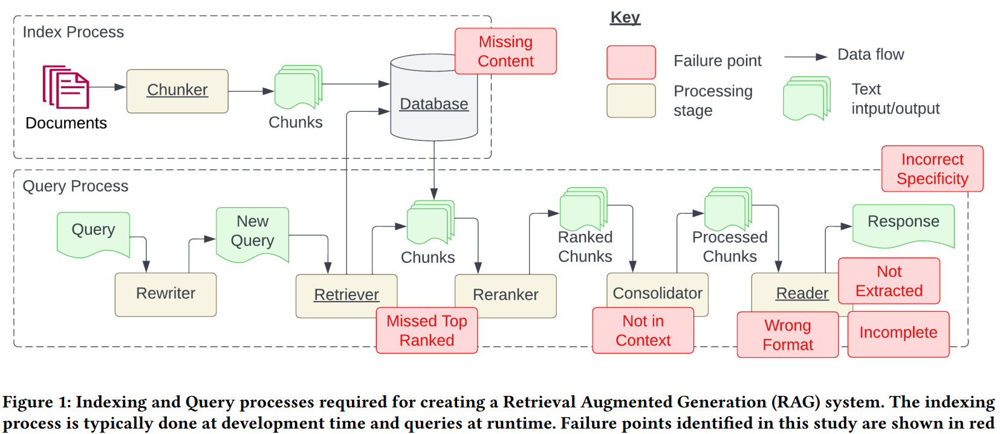
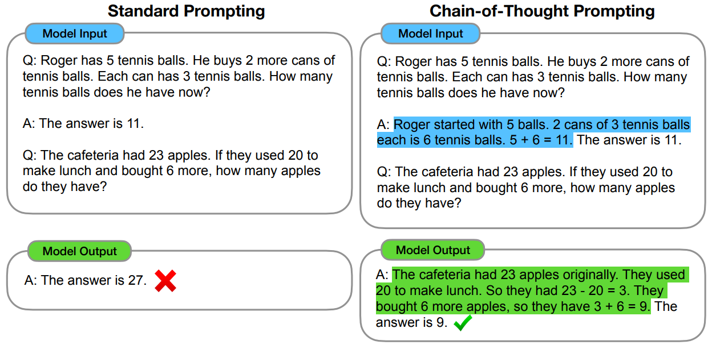
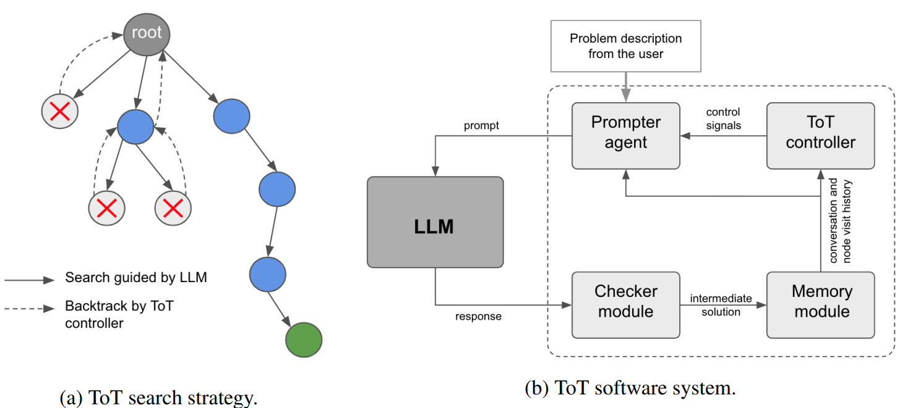

# LLM jako nástroj pro namodelování zadané domény

## [Conceptual model interpreter for Large Language Models](https://arxiv.org/abs/2311.07605)
- listopad 2023
- [PDF](https://arxiv.org/pdf/2311.07605.pdf)
- [GitHub](https://github.com/fhaer/llm-cmi)

- nepoužívají žádné promptovací techniky
	- prompt obsahuje přímo instrukci, v jakém formátu má výstup vygenerovat + popis domény
	- pro výstupní formát zkoušeli PlantUML a Graphviz
- příklad vstupu a výstupu:




<br />


## [Conceptual Modeling and Large Language Models: Impressions From First Experiments With ChatGPT](https://emisa-journal.org/emisa/article/view/318)
- duben 2023
- [PDF download](https://emisa-journal.org/emisa/article/view/318/200)

- zabývají se tím, jak formulovat prompt + popis domény, aby LLM dokázal vygenerovat co nejlepší model
    - zároveň zkouší i obrácený proces, tedy pro zadaný model vygenerovat odpovídající popis domény

- použité LLM:
    - ChatGPT-3
    - ChatGPT-4

- experimentují se zero-shot a few-shot promptingem

- experimentují s modely v těchto formátech:
    - ER
    - UML
    - Business-Process (BPMN)
    - Heraklit

<br />


## [On the assessment of generative AI in modeling tasks an experience report with ChatGPT and UML](https://link.springer.com/article/10.1007/s10270-023-01105-5)
- březen 2023
- [PDF download](https://link.springer.com/content/pdf/10.1007/s10270-023-01105-5.pdf)
- [GitHub](https://github.com/atenearesearchgroup/chatgpt-uml)

- na základně přibližně 40 středně dlouhých [textových popisů modelů](https://github.com/atenearesearchgroup/chatgpt-uml/blob/main/LogBooks.zip) snaha vygenerovat rozumný výstup s pomocí ChatGPT-3.5 v PlantUML formátu

- příklad:



- hlavně jsou zajímavá jejich pozorování:
	- "Finding 4" (F4) v kapitole 3.1
		- jakmile se pokoušeli nechat LLM vygenerovat rovnou celý model o více jak 8-10 třídách, tak zaznamenali velký počet chyb
		- ale mnohem lépe fungovalo, když nechali ten model postavit postupně prompt po promptu

	- "Finding 9" (F9) v kapitole 3.2
		- vypadá to, že schopnost zachytávat asociace a inheritance závisí na modelované doméně
	- "Finding 17" (F17)
		- ChatGPT má problém s abstrakcí
			- Př.: když chceme namodelovat auto se 4 koly, tak ChatGPT vytvoří pro každé kolo třídu (Př.: "Wheel1", "Wheel2", ...) místo jedné jediné třídy (Př.: "Wheel")
	- "Finding 18" (F18)
		- je potřeba se hodně snažit, aby ChatGPT vygeneroval chtěný model
		- počet interakcí s ChatGPT (= počet zadaných promptů) převyšoval počet elementů v modelu

- v kapitole 5.1 navrhují, že by se LLM dal použít pro auto-complete funkci při modelování
- závěr: ChatGPT LLM zatím ještě není spolehlivý nástroj pro modelování úloh

- poznámka: tento zdroj nejspíš budu citovat, když budu někde na začátku diplomky rozebírat, jakými všemi možnými způsoby bychom mohli použít LLM pro ulehčení práce s konceptuálním modelováním
	- zdůvodním, že chceme LLM používat pro extrahování jednotlivých entity, atributů a vztahů, protože tento zdroj ukazuje, že LLM nedokáže přímo vygenerovat očekávaný model, jakmile obsahuje více než 8-10 tříd, ale na základě svých experimentů říkají, že generování krok po kroku funguje lépe
		- poznámka: možná ne 8-10 tříd, ale jakmile celkový počet entit + atributů + asociací >= 8 až 10, tak výstup přestává být postupně víc a víc použitelný

- tento zdroj je uveden u zadání mé diplomky
    - i kdybych tento zdroj necitoval, tak lze jednoduše díky tomu textu výše odůvodnit, proč je tento zdroj relevantní pro mou práci

<br />


## [LLMs4OL - Large Language Models for Ontology Learning](https://link.springer.com/chapter/10.1007/978-3-031-47240-4_22)
- říjen 2023
- pro stáhnutí PDF je potřeba se přihlásit
- [GitHub](https://github.com/HamedBabaei/LLMs4OL)

- snaží se pomocí LLM řešit úlohy, jako jsou například automatická extrakce obyčejných asociací a is-a asociací
- zkouší tyto typy architektur LLM včetně pár fine-tunovaných:
    - encoder
    - decoder
    - encoder-decoder

- zajímavé je, že pro extrakci obyčejných asociacích jim vyšel jako nejlepší model `Flan-T5-XL`, jinak na zbytek úloh byl nejlepší `ChatGPT-4`
- akorát pozor, že jejich vstupem není plain text v přirozeném jazyce, ale vypadá to spíš na jednotlivé názvy entit a k nim jejich popis
	- prompt pak vypadá nějak takto: "je {entita1} rodičem třídy {entita2}?"
		- LLM pak buď souhlasí, nebo nesouhlasí, čímž automaticky otestují správnost výstupu

<br />

## [Automated Domain Modeling with Large Language Models: A Comparative Study](https://ieeexplore.ieee.org/abstract/document/10344012/)
- říjen 2023
- pro stáhnutí PDF je potřeba se přihlásit
- [použitá data](https://zenodo.org/records/8118642)

- použili ChatGPT 3.5 a 4, ale pouze přes webové rozhraní
- cíl: z popisu domény vytvořit automaticky bez žádné interakce s uživatelem nějaký doménový model (Př.: UML model)
	- ale aby výstup nezávisel na tom, jak moc dobře například ChatGPT umí generovat UML model, tak LLM výstup generuje v jejich strukturovaném plain textu formátu
	- defaultní datový typ atributů nastavují na string

- architektura:


- používají 10 popisů domén, které mají 7-23 tříd, 11-43 atributů a 9-27 asociací
    - z toho 2 popisy domén používají na few-shot prompting, takže ručně hodnotí pouze zbylých 8 popisů domén

- při vyhodnocování každý element (například atribut) zařazují do jedné ze 4 kategorií, kde kategorie 1 znamená, že vygenerovaný element odpovídá sémanticky tomu, co je v očekávaném doménovém modelu a naopak kategorie 4 znamená, že vygenerovaný element vůbec není sémanticky v očekávaném doménovém modelu
	- při výpočtu precisionu a recallu pak elementům v kategoriích 1-2 dávají 1 bod, elementům v kategorii 3 dávají 0.5 bodu a elementům v kategorii 4 dávají 0 bodů

- strana 163 - B. Large language models (LLMs): hezky stručně popisují, jakým způsobem LLM generuje výstup
- strana 163 - C. Fine-tuning and prompting: hezky popisují fine-tuning
- začátek strany 166: říkají, že neexistují žádné vhodné evaluátory pro automatické zhodnocení kvality vygenerovaného konceptuálního modelu
	- odkazují se na některé automatické evaluátory, které mají fungovat za určitých podmínek
- strana 167 - C. Evaluation criteria: hezky stručně popisují, co je to recall a precision a jakým způsobem ho měří
- strana 169 - Answer to RQ2: "Adding reasoning steps may decrease the performance"
	- tedy když použili chain of thoughts, tak jim to akorát zhoršilo výsledek
	- ale je potřeba brát v potaz, že:
		- měli výchozí temperature, čímž možná LLM občas mohlo trochu ignorovat kroky, jakými má postupovat
		- jejich popisy domén příliš nesedí na ty očekávané konceptuální modely, tudíž LLM mohl být ve výsledku zmatený, proč nějaká daná část textu vede na příslušný prvek konceptuálního modelu
		- já negeneruju všechny prvky najednou, takže u mě chain of thought naopak může fungovat dobře

- tento zdroj mám uveden u zadání diplomky

<br />


## [Navigating Ontology Development with LLMs](https://2024.eswc-conferences.org/wp-content/uploads/2024/04/146640137.pdf)
- březen 2024
- [PDF](https://2024.eswc-conferences.org/wp-content/uploads/2024/04/146640137.pdf)
- [GitHub](https://github.com/LiUSemWeb/LLMs4OntologyDev-ESWC2024/tree/main)

- v kapitole 2. "Related Work" zmiňují hodně příbuzných prací

- líbí se mi, jak v kapitole 3.2 "Prompting methods" vysvětlují, co to jsou prompty a promptovací techniky
	- také hezky popisují strukturu svých promptů

- LLM jako prompt dostane popis domény ("story") a několik otázek
	- prompty jsou ve formě šablon, do kterých se později doplní příslušné argumenty (tedy stejný princip jako u nás)
	- celkem pracují se 3 popisy domény, které jsou [zde](https://github.com/LiUSemWeb/LLMs4OntologyDev-ESWC2024/blob/main/Stories/README.MD#here-are-ontology-stories-in-the-experiments)
		- jejich popisy domén jsou asi tak 2x-3x kratší než náš nejkratší popis domény
	- jejich prompty jsou hezky popsány [zde](https://github.com/LiUSemWeb/LLMs4OntologyDev-ESWC2024/tree/main/Prompts#prompts)
	- úplně na konec do "footeru" dávají seznam věcí, na které si LLM má dát pozor
		- například "when i ask to execute plan x, step y, your output at executing steps must be only codes not explanations"

- LLM nejspíš iterativně generuje výstup, který pak dostane znovu na vstupu s dalším zadáním dokud nevygeneruje celou ontologii v Turtle formátu
	- u promptu typu [Graph of Thoughts](https://github.com/LiUSemWeb/LLMs4OntologyDev-ESWC2024/blob/main/Prompts/GoT.md) (GoT) LLM vygeneruje více možných výstupů a ty pak nejspíš LLM zhodnotí a zkombinuje dohromady
	- [LLM vygeneroval tyto ontologie](https://github.com/LiUSemWeb/LLMs4OntologyDev-ESWC2024/tree/main/LLM_OWL_outputs)

- při experimentech zkoušeli [několik různých LLM](https://github.com/LiUSemWeb/LLMs4OntologyDev-ESWC2024?tab=readme-ov-file#models) a několik různých promptovacích technik
	- protože by bylo těžké ručně zhodnotit všechny kombinace, tak nejdřív udělali menší testy, ve kterých vyřadili ty kombinace, které dávaly špatné výsledky
	- jako nejlepší LLM jim vyšel ChatGPT-4
	- jako nejlepší promptovací technika jim vyšla `CQbyCQ`, což v principu znamená to, že LLM se nesnažil vyřešit všechny položené otázky najednou, ale vždy měl za úkol si vybrat pouze jednu z otázek a tu vyřešit
		- výstupy kombinace ChatGPT-4 + `CQbyCQ` jsou prý o trochu lepší než průměrná kvalita toho, co za úkol v první iteraci odevzdali jejich studenti

- v evaluaci hodnotili, jestli LLM vygeneroval správné atributy (datatype property), asociace (object property), abstraktní třídy (reification) a podmínky (restrictions)
	- asi nejlépe to popisují na straně 13 v bodech 1.-4.

- prý by jejich nástroj měl fungovat jako asistent pro modelování, ale to podle mě jenom znamená to, že LLM vygeneruje celý výstup a potom je na uživateli, aby opravil věci, které se mu nelíbí
	- tedy do procesu generování ontologie uživatel nezasahuje, což pro ty jejich krátké texty asi dává smysl, ale s delšími texty ve chvíli, kdy LLM udělá jednu chybu, tak se podle mě tato chyba může potenciálně naakumulovat do velmi špatného celkového výstupu
		- akumulování chyb možná trochu zabrání jejich promptovací technika `Graph of Thoughts`

- ve výsledku mi ten jejich výzkum přijde hodně podobný paperu "Automated Domain Modeling with Large Language Models A Comparative Study" s tím rozdílem, že se jim podařilo zlepšit kvalitu výstupu generováním krok po kroku
	- což ale možná opět funguje jenom díky tomu, že pracují se 3 krátkými texty
		- to v kapitole 5. "Discussion" sami říkají a zdůvodňují to tím, že by modelování s delšími texty stálo více peněz, protože používali placené API

<br />

## [BEAR: Revolutionizing Service Domain Knowledge Graph Construction with LLM](https://link.springer.com/chapter/10.1007/978-3-031-48421-6_23)
- listopad 2023
- pro stáhnutí PDF je potřeba se přihlásit
- [GitHub](https://github.com/HTXone/BEAR)

- pomocí ChatGPT-3 vytváří knowledge graf automatickými dotazy na zdroje dat typu Google Store, WikiData a například články z online novin
    - přijde mi, že podobně jako Martin Gora získává nějaká data z Wikidat, tak tímto způsobem lze získávat nějaká data z různých zdrojů

- architektura:



<br />

- v [tomto](https://www.reddit.com/r/LocalLLaMA/comments/1cfdbpf/rag_is_all_you_need/) Reddit postu uživatel `cyan2k` vysvětluje, že RAG lze hodně vylepšit pomocí Knowledge grafů:

```
For the uninitiated:

RAG gives AI the possibility to access data it was never trained on, with all the advantages OP already described.

But one problem is that RAG isn’t contextual. Meaning if I ask the AI, “Who is John’s best friend?” it will search its RAG database for "John"-related entries, but it won't necessarily lead me to the answer of who John's best friend is.

Knowledge Graphs map relations between entities. The "John" entity surely has "KNOWS", "LIKES", "TALKED TO", and other relations to different entities. So, after letting the AI look up its RAG store, you also let it look up the Knowledge Graph. When it sees the relations the John entity has, it’s usually smart enough to figure out that John’s best friend is probably the person with the most connections to John.

It brings like another new dimension to the whole RAG thing, especially for "multi-hop" questions. Questions you would need to take a few "mental hops" to reach their answer.

Who creates the Knowledge Graph, you ask? Well, the AI does in a similar process as it creates its RAG store. For the very lazy, you just ask it to directly create the neo4j query to create the graph based on text snippets.

So if you're already running some RAG projects, it's time to get your hands on some neo4j knowledge, because this will be huge ;)
```

- sice nestíhám experimentovat s knowledge grafy, ale mohl bych si k tomu aspoň něco přečíst


<br />


# Retrieval-Augmented Generation

## [RAG for LLMs: A Survey](https://arxiv.org/abs/2312.10997v4)
- prosinec 2023
- [PDF](https://arxiv.org/pdf/2312.10997v4)

- rozděluje RAG do 3 kategorií:
    - naive
    - advanced RAG
    - modular RAG

- naive RAG je speciálním případem advanced RAGu a advanced RAG je speciálním případem modular RAGu

- úvod:
	- obsahuje stručné shrnutí problémů, které se snaží zmírnit RAG s odkazy na jiné práci
	- stručně popisuje, jak funguje RAG a že tímto dochází ke zmírnňování těch zmíněných problémů

- obsahuje definici RAGu
- obsahuje hromadu různých technik, které lze v určitých situacích použít pro zlepšení RAGu
- ukázka obecného RAG procesu:



- tento zdroj mám uveden u zadání diplomky


<br />


## [Seven Failure Points When Engineering a RAG System](https://arxiv.org/abs/2401.05856)
- leden 2024
- [PDF](https://arxiv.org/pdf/2401.05856)

- vizuální přehled failure pointů:



<br />

- myslím, že většinu těch failure pointů máme ošetřenou tím, že výstup LLM hned neaplikujeme, ale uživatel nejdřív musí vygenerované návrhy potvrdit

- hlavně jsou pro mě zde zajímavé způsoby, kterými lze dokumenty rozdělovat na chunky:
	1. heuristicky
		- rozdělování textu na předem dané části
			- například dělení na jednotlivé věty, nebo odstavce

	2. sémanticky
		- výsledná část textu je tvořena nějakým sémantickým celkem
			- poznámka: to se pak bude hodit do diplomky popsat, že lze použít i tento přístup	
			- pod tím sémantickým rozdělováním si představuju, že:
				1. nějaký LLM jako například ChatGPT dostane za úkol rozdělit dokument na sémantické části
				2. nějaký embedding jazykový model převede například jednotlivé věty do vektorového prostoru a potom například sloučí sémanticky podobné sousedící věty do jednoho chunku
					- zde by se ale pravděpodobně dal vymyslet protipříklad, pro který by to nefungovalo
					- nejspíš by nejprve bylo potřeba nahradit zájmena jmény, aby bylo zřetelnější, které věty na sebe odkazují


<br />


# Promptovací techniky

## [Chain-of-Thought Prompting Elicits Reasoning in LLMs](https://proceedings.neurips.cc/paper_files/paper/2022/hash/9d5609613524ecf4f15af0f7b31abca4-Abstract-Conference.html)
- leden 2023
- [PDF](https://arxiv.org/pdf/2201.11903.pdf)



- říkají, že CoT zlepšuje výstup pouze u LLM s aspoň cca 100 miliardy parametrů
	- LLM s méně parametry prý nedokáží typicky generovat logicky správné myšlenky
	- to je v rozporu s aktuální dobou, protože CoT funguje dobře i s LLM, které mají méně parametrů
        - ale je možné, že počet parametrů LLM koreluje se schopností LLM dávat lepší výsledky při postupování krok po kroku

- udělali experiment, ve kterém nechali vygenerovat výsledek a až pak posloupnost myšlenek
    - zjistili, že kvalita výstupu odpovídá tomu, jako kdyby si nechali vygenerovat pouze výstup bez té posloupnosti myšlenek
    - na základě tohoto používám triky typu: vygeneruju si nejdřív původní text pro příslušný prvek a až pak jeho název

- tento zdroj mám uvedený u zadání diplomky hlavně kvůli tomu zmíněnému experimentu


<br />


## [Automatic Chain of Thought Prompting in Large Language Models](https://arxiv.org/abs/2210.03493)
- říjen 2022
- [PDF](https://arxiv.org/pdf/2210.03493.pdf)
- je to sice trochu starší research paper, ale prý když místo promptu typu "Let's think step by step" do promptu dáme nějaký podobný příklad včetně jeho řešení krok po kroku, tak dostaneme o trochu lepší výstupy
	- to "automatic" v názvu znamená to, že na základě položené otázky od uživatele dojde k automatickému vyhledání podobné již vyřešené otázky (nebo více podobných vyřešených otázek) se step by step řešením, která se do promptu vloží jako příklad
        - neboli je to kombinace few-shot promptingu a chain-of-thoughts

<br />


## [Large Language Model Guided Tree-of-Thought](https://arxiv.org/abs/2305.08291)
- květen 2023
- [PDF](https://arxiv.org/pdf/2305.08291.pdf)
- motivace: při řešení složitějšího problému člověk typicky postupuje tak, že rozvíjí několik větví myšlenek, kterými se snaží daný problém vyřešit
	- přitom je nejlepší umět ověřit správnost každého kroku, aby i pak finální výsledek byl správný
	- ale auto-regresivní jazykové modely dělají to, že nový token generují na základě těch předchozích, což omezuje kapacitu toho modelu uvědomit si vlastní chybu
		- toto pak může vést k tomu, že se na počátku z menší chyby postupně může stát větší chyba a kvalita výstupu je tak horší a horší

- pomocí tree-of-thoughts se snaží vyřešit sudoku
	- LLM vždy vygeneruje pouze jeden krok a tzv. checker module po každém kroku ověří, jestli ten krok nevede do chybného stavu ověřením pravidel sudoku
		- pokud LLM vygenerovuje chybný tah, tak dojde ke vrácení v rámci dané větve výpočtu
		- pokud LLM opakovaně generuje chybné tahy z jednoho příslušného stavu, tak dojde k provedení k více návratům ve stromu výpočtů

    - u mě správnost vygenerovaných entit/atributů/vztahů sice nemám jak automaticky ověřit, ale to ověření pak může udělat uživatel
		- například LLM vygeneruje příliš obecný atribut, ale původní text obsahuje více podrobnějších atributů
			- uživatel klikne na tlačítko "Show more/Expand"
			- LLM dostane upravený prompt k vygenerování více atributů, neboli se stane to, že LLM má za úkol rozvinout příslušnou větev výpočtu

- architektura:

