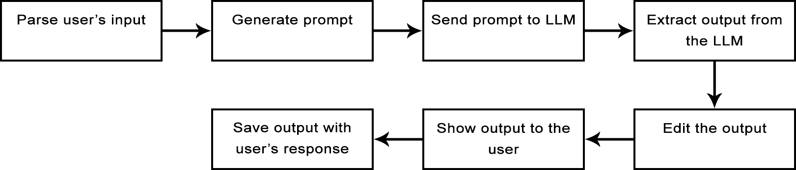
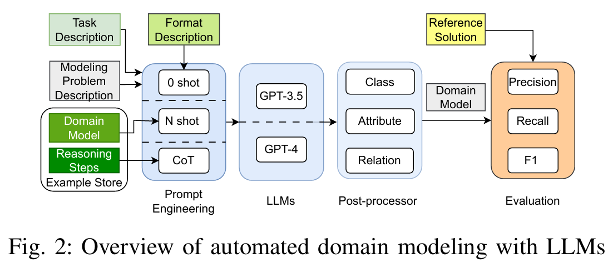

# Thesis notes
- text diplomky pak bude v angličtině, poznámky zatím píšu v češtině
- v těchto poznámkách pro prvky konceptuálního modelu používám pojmy: "entities", "attributes", "relationships"
    - ale v kódu i pak v článku a diplomce budeme používat pojmy: "classes", "attributes", "associations"
        - důvod: přijde mi, že LLM lépe rozumí promptům, které obsahují tyto pojmy
            - a chceme, aby použité pojmy v promptech byly konzistentní s pojmy v kódu a textu

 

## Featury LLM asistenta

- obecné pravidlo, kterým se řídíme: LLM se může kdykoliv splést, proto finální rozhodnutí je vždy na uživateli, jestli chce daný návrh přijmout

 

1. navrhování prvků konceptuálního modelu
    - vyjmenování jednotlivých úloh:
        - návrh entit
        - návrh atributů pro zadanou entitu
        - návrh vztahů pro zadanou zdrojovou, nebo cílovou entitu
        - návrh vztahů pro zadanou zdrojovou a cílovou entitu

    - poznámka: dále by bylo možné i navrhovat generalizace (možná to v rámci diplomky přidám)
    - TODO: podrobněji popsat všechny jednotlivé úlohy a nejspíš uvést konkrétní příklady
    - ke každému návrhu snaha ukázat kontext kolem něj, aby se uživatel mohl rychle rozhodnout, jestli chce příslušný návrh použít, nebo ne
        - například pokud je zadán popis domény, tak lze si každý návrh nechat zobrazit v popisu domény
        - to slouží k tomu, aby se s aplikací rychleji a lépe pracovalo

 

2. sumarizace označené části konceptuálního modelu
    - varianty:
        - nestrukturovaná sumarizace v plain textu
        - strukturovaná sumarizace v popiscích

    - TODO: popsat, co umožníme uživateli nastavovat za parametry

 

3. zvýraznění toho, co má uživatel již namodelováno
    - zde lze rozebrat:
        - jakým způsobem automaticky hledám vygenerované původní texty v popisu domény
        - zmínit, jak funguje sjednocování původních textů, když uživatel chce v popisu domény zvýraznit původní texty pro více prvků
        - na jaké hlavní problémy jsem narazil a proč některé zvýrazněné prvky v popisu domény ve skutečnosti nemusí být namodelovány a naopak

            - například dejme tomu, že v popisu domény je uvedena tato věta: "Student je osobou, která..."
                - pokud je tato věta obsažena v původním textu pro studenta, tak ve chvíli, kdy uživateli zvýrazníme tento původní text v popisu domény, tak to bude vypadat, jako kdyby uživatel už měl namodelované dvě entity: student a osoba
                - možné řešení: u entit negenerovat původní text, jenom v popisu domény zvýraznit název příslušné entity

            - příklad problému u atributů: "Totožnost osoby se prokazuje buď občankou, nebo řidičákem."
                - dává smysl, že atribut "občanka" u entity "osoba" jako původní text bude mít celou tu větu z příkladu
                - opět problém, že při zvýraznění tohoto původního textu v popisu domény to bude vypadat, jako kdyby uživatel měl namodelované dva prvky: občanku a řidičák
                    - to znamená, že ten původní text pro atribut "občanka" by měl vypadat spíš takto: "Totožnost osoby se prokazuje buď občankou"
                        - zde možná malý problém, že z toho původního textu nemusí být zřejmá kardinalita pro občanku
                        - problém: je těžké přesně vysvětlit LLM, jak má vypadat vygenerovaný původní text
                            - asi nejlepší by bylo dát do promptu hromadu příkladů původních textů a odpovídajících prvků, aby LLM z toho odvodil, jak ty původní texty má generovat

            - jako future work by se dal zkusit obrácený přístup:
                - vstup LLM: popis domény a uživatelův konceptuální model
                - výstup LLM: části popisu domény, které nejsou namodelovány v uživatelově konceptuálním modelu
                    - plus případně k tomu nějaká úroveň jistoty od 1 do 10, jak moc si LLM myslí, že ten text není namodelován v uživatelově konceptuálním modelu

- TODO: ke každému bodu by to chtělo popis a nejlépe názornou ukázku na obrázcích

 

## Data
- TODO: vyjmenovat a popsat, s jakými popisy domén pracujeme
    - charakterizovat ty 3 varianty popisů domén

- TODO: hodilo by se sem dát tabulku s počtem entit, atributů a vztahů pro každý popis domény, aby bylo vidět, s jak velkými texty pracujeme

- máme i anotované popisy domény a zdůvodnit proč
    - zde každý prvek očekávaného modelu má k sobě původní text, ze kterého vyplývá
    - hlavní důvody:
        - lze automaticky otestovat filtrování popisu domény
        - lze do promptu dát konkrétní příklady, jakým způsobem má LLM generovat původní texty pro vygenerované prvky
        - původní texty zachycují sémantiku každého prvku, tudíž při manuálním zhodnocení lze snáze porovnat, jestli vygenerovaný prvek odpovídá příslušnému očekávanému prvku

- TODO: vysvětlit naše předpoklady: popis domény, který nejprve nějaký analytik určitým způsobem upraví
    - ale jinak dokážeme pracovat s libovolným popisem domény, jenom kvalita výstupu bude možná o trochu horší

- jeden popis domény s očekávaným modelem používáme pro vkládání konkrétních příkladů do promptů
    - ten popis domény je co nejobecnější, aby mu každý LLM co nejvíce rozuměl
    - důvod: doufáme, že tím pádem i těm našim příkladům LLM co nejlépe porozumí a dokáže z nich pochopit, co po něm chceme

 

## Jaké LLM používáme
- poznámka: bude dobré někde na začátku upozornit na to, že pracujeme se středně velkým LLM
    - proto je možné, že narážíme na některé problémy, které by s větším LLM nenastaly

- pro odladění promptů používáme [tento](https://huggingface.co/TheBloke/Mixtral-8x7B-Instruct-v0.1-GGUF) LLM
    - konkrétně používáme variantu `mixtral-8x7b-instruct-v0.1.Q5_K_M.gguf`
        - každý parametr je místo 16 bitů zakódován do přibližně 5 bitů

- TODO: pak zmínit, jaké další LLM jsme použili pro experimenty a zdůvodnit, proč jsme je vybrali

 

## Prompty

### Obecná pravidla, kterými se řídíme při promptování
- prompty píšeme v angličtině, protože většina LLM při trénování viděly nejvíce textů v tomto jazyce, tudíž anglickému vstupu a výstupu nejlépe rozumí

- nestrukturovaný vstup dáváme v plain textu a strukturovaný vstup dáváme v JSON formátu
    - důvod: typicky největší množina trénovacích dat pro LLM pochází z internetu
        - zde je nejvíce rozšířený:
            - plain text pro nestrukturované předávání informací
            - nejspíš JSON pro strukturované předávání informací

- prompty sami předpřipravujeme jako šablony, do kterých se později vyplní jednotlivé položky na základě uživatelova vstupu
    - nechceme uživateli dát možnost napsat si vlastní prompt, protože na formátu a obsahu promptu hodně záleží
    - hlavní důvody, proč si prompty předpřipravit jako šablony:
        - potřebujeme co nejvíce konzistentních podmínek pro otestování, jestli LLM dává rozumné výstupy pro různou množinu vstupů
        - na konkrétních slovech v promptu hodně záleží
            - v nejhorším případě se může stát, že LLM vůbec promptu nebude rozumět a uživatel bude zbytečně čekat na nesmyslný výstup, který pak nevyužije
            - existuje celá řada tipů, jak psát prompty viz například [zde](https://learn.microsoft.com/en-us/azure/ai-services/openai/concepts/advanced-prompt-engineering?pivots=programming-language-chat-completions)
                - poznámka: zde lze shrnout pár nejlepších praktik pro psaní promptů
                    - například konzistentní používání pojmů: pokud v jedné větě mluvíme o entitách, tak v další větě se na ně odkazovat jako na třídy (nebo jiným podobným výrazem) může způsobit zmatení
        - výstup LLM potřebujeme umět automaticky naparsovat
            - tedy minimálně musíme předpřipravit část promptu, která specifikuje formát výstupu

### Struktura promptu
[Zde](https://github.com/Dominik7131/Conceptual-Modeling-LLM-Assistant/tree/master/prompts) je odkaz na seznam všech našich promptů. Typicky se naše prompty skládají z těchto částí:
1. hlavní řídící instrukce
2. specifikace konkrétního postupu
3. příklad výstupního JSON formátu
4. konkrétní příklad vstupu a výstupu
5. vstupní data

#### 1) Hlavní řídící instrukce
- zde přesně specifikujeme, co chceme vykonat
    - například: "Generate attributes for given entity: {source_entity}"
        - {source_entity} je značka, za kterou se doplní ta entita, pro kterou uživatel chce vygenerovat atributy
            - seznam všech značek je [zde](https://github.com/Dominik7131/Conceptual-Modeling-LLM-Assistant/blob/e2b741a5bba4e1776b45c62111f797d4d69767a0/text_utility.py#L53)
                - TODO: zdokumentovat všechny značky na GitHubu
        - chceme ten problém pojmenovat podle toho, jak se mu nejčastěji říká na internetu, protože odtud je typicky většina trénovacích dat, aby LLM jen podle názvu daného problému už s co největší pravděpodobností věděl, co se po něm chce
            - poznámka: jako future work by bylo zajímavé vyzkoušet, jakým způsobem se u vztahů změní kvalita výstupu, když místo pojmu "relationship" použijeme pojem "association"
                - přijde mi, že ve chvíli, kdy jsem v promptu pro generování vztahů nahradil "relationships" za "associations" a "entities" za "classes", tak najednou Mixtral začal rozumět tomu, co po něm chci
                    - ale chci to ještě více otestovat, jestli to třeba není jenom náhoda

    - chceme toto udělat úplně na začátku, protože podle několika zdrojů, LLM jsou typicky natrénovány tak, aby největší prioritu přiřadily textu na začátku promptu

- pokud chceme, aby se LLM čistě držel popisu domény, pak první slova promptu obsahují "Solely based on the given context"
    - poznámka: tady by se možná hodilo psát "Solely based on the given **domain description**"
    - pokud chceme, aby se LLM čistě držel svých natrénovaných parametrů, tak prostě nic neřekneme

#### 2) Specifikace konkrétního postupu
- poznámka: zde lze dát nějaké ukázky článků o tom, že chain of thought a tree of thoughts v některých případech o hodně zlepšují kvalitu výstupu, především v úlohách, které vyžadují řešení krok po kroku
    - na takové články jsou odkazy například [zde](https://www.mercity.ai/blog-post/guide-to-chain-of-thought-prompting#cot-vs-other-methods)
    - poznámka: zde lze vyjmenovat všechny možné chain of thoughts varianty a zamyslet se nad tím, která je pro nás nejvhodnější
        - například: Least-to-Most Prompting, Auto-CoT

- úloha generování návrhů pro daný prvek konceptuálního modelu se typicky skládá ze dvou částí (neboli jakým způsobem by tu úlohu řešil člověk):
    1. nalézt kontext pro daný prvek
        - poznámka: Retrieval augmented generation (RAG) má za úkol tuto úlohu zjednodušit
    2. z kontextu vyextrahovat konkrétní informace, jako je například název daného prvku
    - například pro vygenerování atributů pro zadanou entitu nejdříve potřebujeme najít v popisu domény místa, kde se příslušná entita nachází a potom z těchto míst vyextrahovat případné atributy

- proto v našich promptech jako první chceme vygenerovat pro daný návrh původní text (to je ten zmíněný kontext pro daný prvek) a potom až chceme nechat vygenerovat například název konkrétního návrhu
    - cílem je přinutit LLM, aby nejprve vykonal ten zmíněný první krok a pak až druhý
        - obava je taková, že pokud LLM jako první vygeneruje například název atributu, tak:
            - za prvé to může znamenat, že dělá ty oba zmíněné kroky najednou, což možná může zhoršit kvalitu výstupu podobně, jako když se LLM snaží vyřešit matematickou slovní úlohu najednou a kvůli tomu vydá špatný výsledek (je to jen hypotéza, bylo by to potřeba pořádně otestovat)
            - za druhé to může znamenat, že LLM bude původní text generovat na základě toho předem vygenerovaného názvu atributu, což může být problém, pokud je název atributu špatně (opět by to bylo potřeba pořádně otestovat)

    - podle našeho menšího experimentu to vypadá, že lze dále zlepšit kvalitu výstupu tím, že si necháme původní text a název daného prvku nejdřív vypsat v plain textu a až potom si to necháme vypsat v JSON formátu
        - tento přístup označujeme jako "chain of thoughts"
    - poznámka: z nějakého důvodu toto pro generování entit nefunguje, ale třeba to jenom nefunguje pro náš LLM
    - poznámka: tento přístup používáme pro generování atributů a vztahů

- poznámka: zde bych potom mohl něco napsat o tree of thoughts až to vyzkouším

#### 3) Příklad JSON formátu
- hlavní důvod: slouží pro specifikování JSON formátu, který chceme na výstupu, abychom ho pak mohli automaticky naparsovat

- podobně jako v předchozím bodě i zde se při specifikování formátu výstupu držíme toho, že jako první uvedeme položku pro původní text, aby LLM jako první hledal původní text pro daný prvek

#### 4) Konkrétní příklad vstupu a výstupu
- provádíme tzv. few-shot prompting

- hlavní důvody použití:
    1. možné zvýšení kvality výstupu díky tomu, že LLM lépe promptu porozumí
        - neboli v promptu nejdříve slovy popíšeme a pak názorně ukážeme, co chceme
        - pokud LLM nerozumí tomu, co například znamená "generate relationships", tak to aspoň může zkusit pochopit z těchto konkrétních příkladů
            - pokud LLM slovnímu zadání rozumí, tak na tom příkladu se aspoň ujistí, že ví, co má generovat
        - poznámka: zde lze uvést některé články ukazující, že few-shot prompting v některých úlohách o hodně zlepšuje kvalitu výstupu
    
    2. zlepšení názvů návrhů a obecně i ostatních položek
        - bez konkrétního příklad není jasné, v jakém formátu mají být například názvy jednotlivých atributů
            - například jestli slova mají být oddělena podtržítkem (snake_case), velkým písmenem (camelCase, PascalCase), nebo standardně mezerou
            - ale pro jistotu stejně kontrolujeme, že každá položka výstupu je ve standardním formátu
                - důvod: LLM se kdykoliv může splést, nebo něco špatně pochopit

        - kromě změny formátu také může dojít ke změně toho, jakým způsobem názvy vypadají
            - například bez few-shot promptování se může stát, že každý atribut bude vypadat takto: "has name", "has ID", "has email", atd.
            - ale když uvedeme example, tak ty názvy atributů pak budou vypadat takto: "name", "ID", "email", což je více typický název pro atributy 

    3. pro user experience, abychom uživateli mohli rychleji začít ukazovat výstup
        - examplem názorně ukážeme, jakým způsobem má LLM generovat výstup
        - toto je hlavně potřeba u našeho chain of thoughts přístupu, aby LLM ke každému návrhu rovnou vygeneroval i příslušný JSON objekt a nestalo se, že všechny JSON objekty budou až úplně na konci výstupu
        - poznámka: toto je hlavně potřeba pro méně kvalitní LLM, ale například z mé zkušenosti ChatGPT-3.5 pochopil hned podle specifikování konkrétního postupu, jakým způsobem má výstup vygenerovat a konkrétní příklad nebyl potřeba

- otázkou je, jaký je ideální počet příkladů
    - nedostatek příkladů: riziko, že LLM nepochopí, co se po něm chce
    - moc příkladů:
        - zbytečně plýtváme context window size
        - možná "přetrénování" především u slabších LLM v tom smyslu, že LLM vidí tolik příkladu z ukázkového popisu domény, že pak začne z tohoto popisu domény generovat návrhy a bude ignorovat popis domény zadaný od uživatele

#### 5) Vstupní data
1. pro některé prompty zde dáme konceptuální model v JSON formátu
    - future work: hodily by se experimenty s dalšími formáty, jestli by to vylepšilo kvalitu výstupu
        - hypotéza: kvalitu výstupu to znatelně neovlivní, dokud použijeme formát, který příslušný LLM viděl hodněkrát v trénovacích datech

2. pro některé prompty zde dáme popis domény v plain textu
    - provádíme filtrování popisu domény
        - to znamená, že se snažíme do promptu dát pouze ty informace z popisu domény, které LLM potřebuje k vygenerování správného výstupu
            - například pokud uživatel chce atributy pro entitu "animal", tak do promptu chceme dát pouze části textu hovořící o zvířatech

## Retrieval augmented generation (RAG)
- poznámky:
    - hodila by se nějaká definice
    - hodilo by se z obecného hlediska popsat, jak to funguje a ukázat nějaký obrázek
    - lze vyjmenovat několik základních RAG přístupů
        - hromadu různých přístupů popisuje tento [článek](https://arxiv.org/pdf/2312.10997)
    - dalo by se tady pak uvést i základní RAG pitfally z článku [zde](https://arxiv.org/abs/2401.05856) a jakým způsobem se jim vyhýbáme

- RAG používáme ve formě filtrování popisu domény při generování atributů a vztahů
    - při generování entit nefiltrujeme popis domény, protože nemáme podle čeho filtrovat

- hlavní důvody proč to děláme:
    1. když z popisu domény dáme pryč neužitečné informace, tak tím má LLM menší prostor pro dělání chyb, čímž potenciálně zlepšíme recall a precision při generování atributů a vztahů

    2. výsledný prompt ve výsledku bude kratší, což znamená, že ho LLM rychleji zpracuje a uživatel o trochu rychleji uvidí výstup
        - pokud bychom používali placený LLM, tak zde se platí za každý token a tímto bychom snížili výslednou částku
        - poznámka: zde bychom třeba mohli zmínit, kolik času llama.cpp zpracovává prompt například s x tokeny
            - x můžeme odhadnout zprůměrováním velikostí našich testovacích popisů domén
            - možná ale ta informace bude k ničemu, protože aby ta naše aplikace byla použitelná pro více uživatelů, tak bychom stejně potřebovali více grafických karet a pravděpodobně i lepší LLM

- varianty filtrování:
    - žádné (slouží pro porovnání s ostatními přístupy)
    - syntaktické
    - sémantické

- záleží na tom, na jak velké části budeme popis domény rozdělovat
    - když části budou příliš velké, tak riziko, že v promptu zbytečně budou nepotřebné části textu
    - když naopak části budou příliš malé, tak riziko, že nebudou obsahovat dostatek kontextu k tomu, aby filtrovací algoritmy dokázaly správně posoudit, jestli tu část textu mají ponechat, nebo odstranit

- popis domény dělíme na jednotlivé věty
    - plus pro přidání kontextu každá věta obsahuje metadata, kde například může být odkaz na nějakou jinou větu
        - například text za odrážkou k sobě vždy do metadat dostane nadpis nad odrážkami (neboli nejbližší větu, před kterou není odrážka)

- poznámka: zde lze navázat na tu zmiňovanou ztrátu kontextu u příliš malých částí textu a mít tu podkapitolu o řešení problému se zájmeny
    - toto zlepší recall i precision pro syntaktické i sémantické filtrování
    - zjednodušená varianta: pokud věta začíná zájmenem, tak té větě dáme do metadat odkaz na předchozí větu, protože typicky předchozí věta obsahuje tu entitu, na kterou se to zájmeno odkazuje
    - nejspíš lepší varianta: mít jazykový model, který na začátku dostane celý popis domény a pro každé zájmeno nám řekne, na co se odkazuje
        - potom tuto informaci nějak zakomponujeme do metadat příslušné věty
        - tomuto nahrazování zájmen se říká tzv. coreference resolution
        - poznámka: zde by se hodil rozbor modelů, které dělají coreference resolution a zdůvodnit náš výběr modelu

### Syntaktické filtrování
- motivace: z předpokladů o našich datech víme, že v popisu domény jednotlivé prvky nemají obsahovat synonyma
    - proto kontext pro příslušnou entitu lze hledat syntakticky na základě názvu této entity

- základní princip: uživatel nám zadá entitu, pro kterou chce vygenerovat atributy, nebo vztahy
    - název této entity převedeme do základních tvarů na tzv. lemmata
    - následně odstraníme ty věty z popisu domény, které neobsahují tato lemmata
        - technická poznámka: pro lemmatizaci používáme MorphoDiTu
            - pro zajištění lepší konzistence děláme to, že převádíme vždy slova jednotlivě na lemmata
                - protože když převádíme například celé věty na lemmata, tak se může stát, že slovo v jednom kontextu má určité lemma, ale to samé slovo v jiném kontextu může mít jiné lemma, což způsobuje problémy

### Sémantické filtrování
- základní princip: uživatel nám zadá entitu, pro kterou chce vygenerovat atributy, nebo vztahy
    - název této entity jazykový model převede do vektorového prostoru
    - následně odstraníme ty věty z popisu domény, které ve vektorovém prostoru si nejsou podobné příslušnému názvu entity
        - "nejsou podobné" záleží na tom, jak nastavíme hranici podobnosti
        - jazykový model vrací podobnost například v rozmezí -1 až 1
            - je na nás, jestli například odstraníme každou větu se skórem < 0.5
            - problém: skóre jsou relativní
                - to znamená, že v jednom případě má nejpodobnější věta skóre například 0.9 a jindy má nejpodobnější věta skóre například 0.3, proto nastavit pevnou hranici nedává smysl
                - přijde mi, že poměrně dobře funguje, když stanovím interval, jak daleko může být skóre od maximálního skóre
                    - například pokud je tento interval 0.2, tak pokud je maximální skóre = 0.9, tak zahodíme všechny věty, které mají skóre < 0.9 - 0.2 = 0.7 a pokud je maximální skóre = 0.3, tak zahodíme všechny věty, které mají skóre < 0.3 - 0.2 = 0.1

- poznámka: zde bych mohl klasifikovat jazykové modely pro převod textu do vektorové reprezentace + zdůvodnění toho, jaké modely používáme
    - například symetrické vs. asymetrické ([odkaz](https://www.sbert.net/examples/applications/semantic-search/README.html))
    - další typy modelů [zde](https://www.sbert.net/docs/pretrained_models.html)
    - poznámka: zde je výhoda, že ty modely můžeme automaticky otestovat, takže klidně lze zkusit více modelů
        - jenom nevýhoda, že každému modelu vyhovuje jinak nastavená hranice podobnosti, takže potřeba udělat například for cyklus, který pro každý model vyzkouší několik parametrů

## Parametry LLM pro generování výstupu
- temperature = 0
    - TODO: vysvětlit co je to temperature
    - rozsah temperature je od 0 do 2
    - vysvětlit proč temperature nastavujeme na 0
        - zkusím to podpořit nějakými zdroji
    - pro sumarizaci necháváme uživatele si nastavit temperature podle sebe
        - TODO: proč to děláme

- poznámka: zde bych mohl vyjmenovat další hlavní parametry a jakým způsobem ovlivňují výstup
    - například repetition penalty

- chtěl bych nastavit parametry tak, aby se po každé uživateli objevil jiný výstup
    - tedy když s výstupem nebude spokojený, tak si nechá výstup vygenerovat znovu a dostane jiný výsledek

- [zde](https://platform.openai.com/docs/api-reference/chat/create) je odkaz na API, které používám
    - lze zde vyčíst výchozí hodnoty parametrů

 

## LLM asistent pipelina

- TODO: tohle by se pro přehled hodilo někde na začátku, aby si čtenář hned udělal obrázek o tom, jak funguje naše aplikace
    - možná by se hodilo strukturovat diplomku takovým způsobem, abychom postupně popisovali jednotlivé krabičky
    - možná lze obrázek pipeliny ukázat už v úvodu diplomky a popsat na tom, čím se postupně v textu budeme zabývat

Obrázek ze zadání výzkumného projektu:

- chtělo by to:
    - vyznačit, kde dělám filtrování popisu domény
    - naznačit variantnost (semantic/syntactic, CoT/non-CoT)

- TODO: lze se inspirovat architekturou z "Automated Domain Modeling with Large Language Models: A Comparative Study"

## Ostatní poznámky, které je pak potřeba někam umístit

### Extrakce výstupu z LLM
- nefunguje moc dobře si nechat nejdřív vygenerovat celý výstup a ten pak naparsovat
    - hlavní problémy:
        1. z praktických zkušeností víme, že LLM typicky výstup nějak okomentuje
            - i když do promptu dáme instrukci, aby nic nekomentoval, tak toto občas bývá ignorováno (záleží na konkrétním LLM)
            - tudíž ve výsledku by se výstup nedal automaticky naparsovat, uživatel by zbytečně čekal, než se něco vygeneruje a pak by nic nedostal

        2. pro lepší user experience se hodí parsovat výstup LLM během generování
            - například pokud se první položka výstupu vygeneruje za 1 vteřinu a celý výstup komplet se vygeneruje za 10 vteřin, tak je mnohem lepší uživateli po 1 vteřině zobrazit první položku, než uživateli 10 vteřin nezobrazovat nic a až potom celý výsledek
                - zde lze poznamenat, že naše konfigurace generuje tokeny přibližně rychlostí 50 tokenů za vteřinu, kde 1 token přibližně odpovídá 3/4 jednoho slova

### Úprava výstupu LLM
- odstranění vztahů, které neobsahují v source/target entitě uživatelem zadanou entitu

- odstranění návrhu, pokud neobsahuje všechny povinné položky

- situace, kdy generování výstupu automaticky ukončíme
    - když LLM začne generovat jeden symbol pořád dokola
    - když se LLM rozhodne vygenerovat moc návrhů
        - když uživatel neposkytne popis domény, tak může nastavit maximální počet položek a pak víme, kdy zastavit
        - ale když uživatel poskytne popis domény, tak je dobré po určitém počtu vygenerovaných návrhů zastavit, protože typicky uživatel nebude chtít zkoumat například 100 vygenerovaných návrhů a typicky moc výstupů znamená, že LLM neví, co se po něm chce

### Logování některých akcí uživatele
- hlavní důvody:
    - případný fine-tuning nějaké LLM
    - feedback pro nás, co je potřeba vylepšit
    - případná data pro zhodnocení kvality výstupů

- poznámka: stručně vyjmenovat, jaká data ukládáme

- poznámka o tom, proč nelogujeme každou akci uživatele
    - protože například uživatelem nepoužitý návrh může být naprosto v pořádku, jenom zrovna ho uživatel nechtěl použít
    - protože například uživatel může návrh přidat a pak ho někdy upravit/odstranit
        - to by vyžadovalo, abychom vytvořili skripty, které posloupnost takových akcí detekují a příslušným způsobem upraví uložená data
            - není jasné, z jakého důvodu něco uživatel přidal a pak třeba odstranil
            - bylo by složité se v uložených datech vyznat

 

# Vyhodnocení
- recall a precision pro automatické testy z filtrování popisu domény ve všech variantách
- recall a precision ručního zhodnocení pro vygenerované entity, atributy a vztahy
- možná výsledky z nějakých dotazníků, jak se s naší aplikací pracuje
    - například pro zadaný popis domény, jak dobře se s naší aplikací vytvářel konceptuální model
